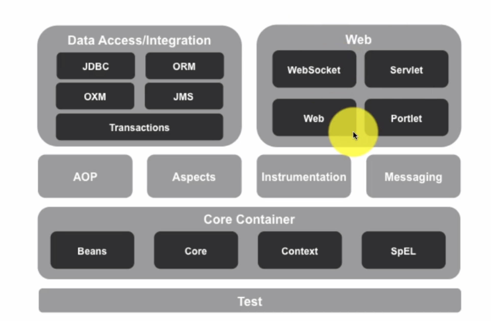

# SPRING BOOT MASTERCLASS
__`Spring is Dependency Injection Framework`__

#### Dependency

- If a class is dependent on another class for some work to do, it is called dependency.
- This is `tight coupling` which is not good way to program

#### Dependency Injection / Inversion of Control


- who is creating the instance of dependency in this example?

- The spring framework is creating the instance in here .(using autowiring)

- We are taking the control from the class that needs the dependency and giving the control to the framework to the spring framework. And this is called __`Inversion of control`__ and that leads us nicely into the next terminology

- IOC Container is a generic terminology to represent anything that is implementing inversion of control.

- In the case of Spring framework the typical IOC container is the application context.

#### Spring concepts


#### Loose Coupling

- `start.spring.io` to start a spring project, it will provide all the required dependencies
- Here we have implemented loose coupling by passing the algorithm to use for sorting in the constructor.


>SortAlgorithm.java
```java

package com.ranjith.springbootdemo;

public interface SortAlgorithm {
	public int[] sort(int[] numbers);
}
```

>BubbleSortAlgoritm.java
```java
package com.ranjith.springbootdemo;

public class BubbleSortAlgorithm implements SortAlgorithm{
	public int[] sort(int[] numbers){
		// dummy impl
		return numbers;
	}
}
```
>QuickSortAlgorithm.java
```java
package com.ranjith.springbootdemo;

public class QucikSortAlgorithm implements SortAlgorithm{
	public int[] sort(int[] numbers){
		// dummy impl
		return numbers;
	}
}
```

>BinarySearchImpl.java
```java
package com.ranjith.springbootdemo;

public class BinarySearchImpl {
	SortAlgorithm sortAlgorithm;
	
	// ctrl + shift + s (short cut)
	// This is loose coupling, we pass the dependency to the binary search in constructor
	public BinarySearchImpl(SortAlgorithm sortAlgorithm) {
		super();
		this.sortAlgorithm = sortAlgorithm;
	}

	public int binarySearch(int[] numbers, int number) {
		//dummy implementation
		// 1. Sort
		
		/*
		 	This tight coupling, betwwen Binary search and bubble sort
			
			BubbleSortAlgorithm bsa = new BubbleSortAlgorithm();
			int[] sortednumbers = bsa.sort(numbers); 
		 */		
		
		// good programming 
		int[] sortedNumbers = sortAlgorithm.sort(numbers);
		System.out.println("Algorithm used is :" + sortAlgorithm);
		
		// 2. Impl Binary Search
		// 3. Return index
		int index = 0;
		return index;
	}
}
```

>SpringbootdemoApplication.java
```java
package com.ranjith.springbootdemo;

import org.springframework.boot.SpringApplication;
import org.springframework.boot.autoconfigure.SpringBootApplication;

@SpringBootApplication
public class SpringbootdemoApplication {

	public static void main(String[] args) {
		BinarySearchImpl bs = new BinarySearchImpl(new BubbleSortAlgorithm());
		int result = bs.binarySearch(new int[] {1, 2, 3, 4}, 3);
		System.out.println(result);
		// ouput = Algorithm used is :com.ranjith.springbootdemo.BubbleSortAlgorithm@3764951d		
		SpringApplication.run(SpringbootdemoApplication.class, args);
	}
}
```

#### @AutoWiring, @Component

- In the above example we are creating binarySearch object, we are creating bubbleSort object. Do we really need to do that ? Wouldn't it be great if our spring creates those for us ?
- Yes, We can use beans to create these objects with the help of spring framework
- In the above example we have one bean (binary Search) and one dependency (bubbleSort)
- If you look in the maven dependencies, spring beans, spring context, spring core are all there (indicates spring is already available for us). Things that we need to tell the spring framework are:
	- What are beans? (`@Component` to indicate beans, here BubbleSort, QuickSort)
	- What are the dependencies of the beans? (`@AutoWired` to indicate dependency, here sortAlgorithm in BinarySearchImpl)
	- Where to search for beans? (`@ComponentScan()` is used, or we can use `@SpringBootApplication` above main class, which indicates it searches current package and subpackages of it)

- SpringApplication.run(...) in main will return the Application context. We can use that application context to get the required beans. `applicationContext.getBean(BinarySearchImpl.class)`

- Now spring is managing beans, managing dependencies for those beans.

- To understand how these are managed by spring you can debug by `logging.level.org.springframework = debug` in `application.properties` file, which will produce lot of debug statements when you run
- You can search `BinarySearchImpl` and track whats being done.

- Process: First componentScan to find where it should search i.e here entire package --> find @Component tagged classes --> creates beans for those classes (if no dependencies) --> (If dependencies) Autowiring via constructor to bean --> this ends creation of beans(with dependencies).

- check issue 1, in that case, we can use `@Primary` for either BubbleSort/QuickSort. (This is dynamic auto wiring )

- __`Contructor Injection / Setter Injection`__ - when you autowire the dependencies in the component you can do it in either way.
- Even though there is no setter, you can just use `@AutoWired SortAlgorithm sortAlgorithm;` and this is enough, kind of works like setter. so need to implement setter also.

#### Issues Faced:

- `Issue 1` : Parameter 0 of constructor in com.ranjith.springbootdemo.BinarySearchImpl required a single bean, but 2 were found:
- `Context`: When I used @Component for both bubble and quick sort. (@Autowired for sortAlgorithm variable in BinarySearchImpl)
- `Action`: Consider marking one of the beans as @Primary, updating the consumer to accept multiple beans, or using @Qualifier to identify the bean that should be consumed.
- __`Spring trouble shooting guide`__ https://github.com/in28minutes/in28minutes-initiatives/tree/master/The-in28Minutes-TroubleshootingGuide-And-FAQ

>SpringbootdemoApplication.java (after autowiring)
```java
package com.ranjith.springbootdemo;

import org.springframework.boot.SpringApplication;
import org.springframework.boot.autoconfigure.SpringBootApplication;
import org.springframework.context.ApplicationContext;

@SpringBootApplication
public class SpringbootdemoApplication {

	public static void main(String[] args) {
		
		ApplicationContext applicationContext = SpringApplication.run(SpringbootdemoApplication.class, args);
		BinarySearchImpl bs = applicationContext.getBean(BinarySearchImpl.class);
		
		int result = bs.binarySearch(new int[] {1, 2, 3, 4}, 3);
		System.out.println(result);
	}
}
```
#### Spring Modules



#### @AutoWiring by name and by @Primary

- @Primary is used for one of the component either bubbleSort or Quick sort. ( just like how we used previously )

- by name is --> instead of creating instance like this `SortAlgorithm sortAlgorithm`, we can directly create `SortAlgorithm bubbleSortAlgorithm` (it directly invokes bubbleSort, we need not initialize that variable also)
- What if I use `SortAlgorithm bubbleSortAlgorithm` and `@Primary` tag for QucikSortAlgorithm ? Quicksort algorithm will be executed __`priority of autowiring by @Primary > autowiring by name`__


#### @Qualifier

- Other than autowiring by name and primary, we can also define qualifier like `@Qualifier("quick")` for QuickSortAlgorithm and `@Qualifier("bubble")` for BubbleSortAlgorithm and we can autowire in BinarySearchImpl using the same `@Qualifier("bubble")`.

- Using this qualifiers, if we need to use different sorting techniques at different places, we can just use the Qualifier tag for that SortAlgorithm Interface instantiation i.e `@Qualifier("quick) SortAlgorithm sortAlgorithm"`

- using just `Qualifier` without any tag name also worked, but we have that for only one component, (just like how primary works)

### Bean Scope
- __`Singleton (Default scope):`__
	- In the above example, if you `System.out.println(binarySearch)` BinarySearch class object, we would get the same address, no matter how many time you create objects like bs, bs1, bs2...etc.
	- That indicates that only one object is created and spring reuses the same obj, everytime when you try to create objects for that class, that is called singleton scope where there is __only one instance per Spring Context__.

- __`Prototype:`__
	- New bean whenever requested

- __`Request:`__
	- One bean per one HTTP Request

- __`Session:`__
	- One bean per one HTTP Session

- Usage: (ex: prototype scope) Tag the BinarySearchImpl class with __`@Scope(ConfigurableBeanFactory.SCOPE_PROTOTYPE)`__

#### Complex Scope Scenarios - Prototype + Singleton

- Consider, we have a person class which uses JDBCConnectino for some for some operations, (dependency relation: Person -->( dependent on) JDBC ).

- In the above case, I need to create Person class only once, but I want different JDBC Connection everytime.

- In this we can use Singleton scope for Person, Prototype scope for JDBC but it wont work.( only one instance will be created for both Person and JDBC eventhough you have mentioned prototype scope, that is because Person class is called only once and it inturn calls JDBC only once)

- One solution is to make Person class as prototype but you are unnecessarily creating objects everytime.

- To solve the above problem, we need to use something called as proxy i.e __`@Scope(value = ConfigurableBeanFactory.SCOPE_PROTOTYPE, proxyMode = scopedProxyMode.TARGET_CLASS`__

- This will ensure that in all the classes where JDBC is used as dependency, for every invocation it will create new object as the scope is prototype.

#### Gang of Four Singleton vs Spring Singleton
- Singleton in GOF will contain only one instance of that specific class in JVM.
- In Spring singleton, one instance of that specific class for one Spring Application context. If you 5 Application contexts running on JVM, you'll have 5 singleton instances of that specific class.

#### @ComponentScan
- When you are in springbootdemo package and you have another package above it (say componentScan), then if we define the application context in springbootdemo package and run the program in componentScan package, it will throw error.
- Reason being the tag `@SpringApplicationContext` in the main program file, that tag makes the spring search for files only in the current packages and its children not above. 
- So we have to manually let the spring know to scan the packages by annotation `@ComponentScan("com.ranjith.componentscan")` (this is used along with @SpringApplicationContext)

#### Lifecycle of a Bean - @PostConstruct and @PreDestroy

- Lets say we need to check if all our required beans for BinarySearchImpl are populated before executing the code, we can do that by method `@PostContruct` which is called usally as soon as dependencies are available.
- similarly `@PreDestory`, called just before bean is removed from the context.

#### Container and Dependency Injection (CDI) - @Named, @Inject

- CDI is an interface which helps us how to do dependency injection.
- Java EE Dependency Injection Standard
- Spring supports most annotations
	- __`@Inject`__ (`@Autowired`)
	- __`@Named`__ (`@Component` & `@Qualifier`)
	- __`@Singleton`__ (Defines a scope of singleton)

- Dependency `javax.inject` in pox.xml to be added in order to work. After including it you can see javax.inject jar files in Maven Dependencies.

#### Removing Spring Boot in Basic Application
- If we want to spring boot and just work on spring, we can do that by removing dependency `spring-boot-starter` and adding `spring-core` and `spring-context` (to make use of application context)

- Application context in spring is defined by using annotation __`@Configuration`__ instead of `@SpringBootApplication` and __`ApplicationContext applicationContext = new AnnotationConfigApplicationContext(OnlySpringDemoApplication.class);`__ instead of `ApplicationContext applicationContext = SpringApplication.run(SpringbootdemoApplication.class, args);`
- Spring boot handles the component scan in the same package, but we need to manuage configure in spring by __`@ComponentScan`__
- `@ComponentScan` will do scan in the current package, or we can also configure like `@ComponentScan("packagename")`
- close the application context with `applicationContext.Close()` or using try method (after java 7, which offers something called as closable)

#### Defining Spring Application Context using XML

- Is there any other way to define beans without using annotations ? Yes, configuring beans in xml files.

- get the basic xml configuration metadata from offical spring.io website

- create `applicationContext.xml` in resources folder and define beans in there with id and class.

- you can get the class name by copying the `qualifying name` in the java file.

- to autowire in xml file, you need to use property tag with reference to the dependent class bean like `<property name="xmlJdbcConnection" ref="xmlJdbcConnection"/>`

- And to create application context for this xml based configuration you need to use __``__ with xml file name.

- __Issues__:  IOException parsing XML document from class path resource [applicationContext.xml];
- __solution__ : possible file name given wrong (or) generally xml files are located in src/main/resources make sure xml file is located in that folder.

- to see what all beans are loaded into the application context we can use method __`applicationContext.getBeanDefinitionNames()`__

- to print all the beans make sure to type cast it to Object when logger is used `(Object)applicationContext.getBeanDefinitionNames()` or when syso is used `Arrays.asList(applicationContext.getBeanDefinitionNames())` ELSE only some random location will be printed.

- __`ComponentScan`__ how do we do component scan in this case i.e using XML configuration, we can define it in applicationContext.xml file.
- In parent `<beans>` change include context i.e
	```xml
	<beans xmlns="http://www.springframework.org/schema/beans"
    xmlns:xsi="http://www.w3.org/2001/XMLSchema-instance"
    xmlns:context = "http://www.springframework.org/schema/context"
    xsi:schemaLocation="
        http://www.springframework.org/schema/beans 
        http://www.springframework.org/schema/beans/spring-beans.xsd
        http://www.springframework.org/schema/context
        http://www.springframework.org/schema/context/spring-context.xsd">

    <context:component-scan base-package = "com.ranjith.springbootdemo"/>
	```
- __Issue__: https://stackoverflow.com/questions/7131479/the-prefix-context-for-element-contextcomponent-scan-is-not-bound

- When component scan is included you can see that the number of beans printed are way more, (you know why)

- you can remove beans from the xml file and use annotations, it would work the same way.
