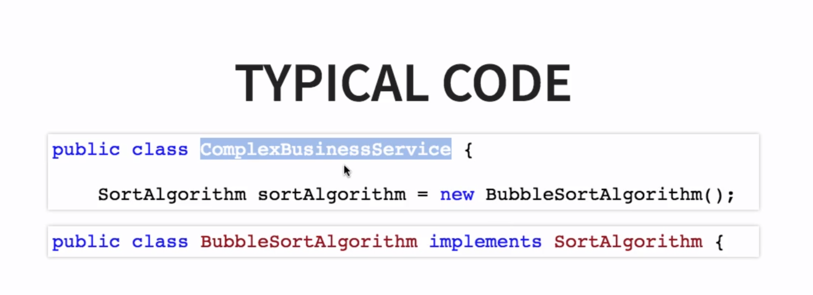
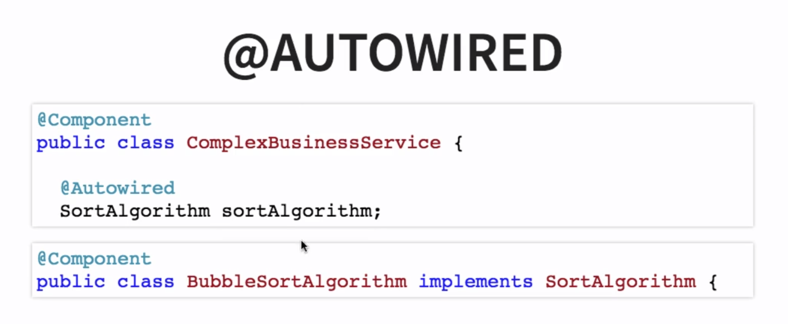
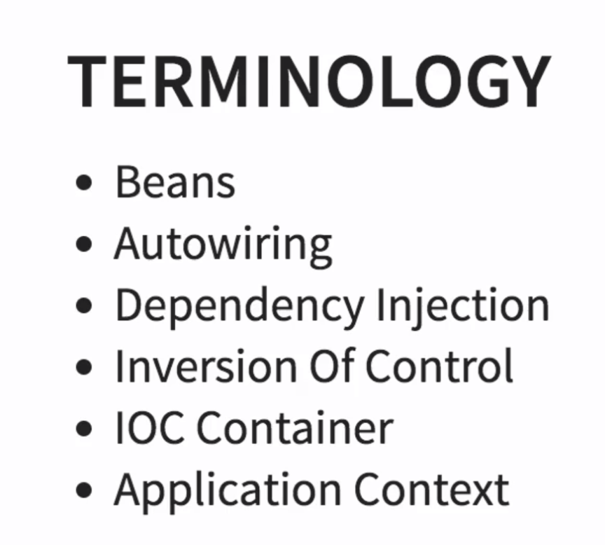

#SPRING BOOT MASTERCLASS
__`Spring is Dependency Injection Framework`__

#### Dependency

- If a class is dependent on another class for some work to do, it is called dependency.
- This is `tight coupling` which is not good way to program

#### Dependency Injection / Inversion of Control


- who is creating the instance of dependency in this example?

- The spring framework is creating the instance in here .(using autowiring)

- We are taking the control from the class that needs the dependency and giving the control to the framework to the spring framework. And this is called __`Inversion of control`__ and that leads us nicely into the next terminology

- IOC Container is a generic terminology to represent anything that is implementing inversion of control.

- In the case of Spring framework the typical IOC container is the application context.

#### Spring concepts

#### Loose Coupling
- `start.spring.io` to start a spring project, it will provide all the required dependencies
- Here we have implemented loose coupling by passing the algorithm to use for sorting in the constructor.


>SortAlgorithm.java
```java

package com.ranjith.springbootdemo;

public interface SortAlgorithm {
	public int[] sort(int[] numbers);
}
```

>BubbleSortAlgoritm.java
```java
package com.ranjith.springbootdemo;

public class BubbleSortAlgorithm implements SortAlgorithm{
	public int[] sort(int[] numbers){
		// dummy impl
		return numbers;
	}
}
```
>QuickSortAlgorithm.java
```java
package com.ranjith.springbootdemo;

public class QucikSortAlgorithm implements SortAlgorithm{
	public int[] sort(int[] numbers){
		// dummy impl
		return numbers;
	}
}
```

>BinarySearchImpl.java
```java
package com.ranjith.springbootdemo;

public class BinarySearchImpl {
	SortAlgorithm sortAlgorithm;
	
	// ctrl + shift + s (short cut)
	// This is loose coupling, we pass the dependency to the binary search in constructor
	public BinarySearchImpl(SortAlgorithm sortAlgorithm) {
		super();
		this.sortAlgorithm = sortAlgorithm;
	}

	public int binarySearch(int[] numbers, int number) {
		//dummy implementation
		// 1. Sort
		
		/*
		 	This tight coupling, betwwen Binary search and bubble sort
			
			BubbleSortAlgorithm bsa = new BubbleSortAlgorithm();
			int[] sortednumbers = bsa.sort(numbers); 
		 */		
		
		// good programming 
		int[] sortedNumbers = sortAlgorithm.sort(numbers);
		System.out.println("Algorithm used is :" + sortAlgorithm);
		
		// 2. Impl Binary Search
		// 3. Return index
		int index = 0;
		return index;
	}
}
```

>SpringbootdemoApplication.java
```java
package com.ranjith.springbootdemo;

import org.springframework.boot.SpringApplication;
import org.springframework.boot.autoconfigure.SpringBootApplication;

@SpringBootApplication
public class SpringbootdemoApplication {

	public static void main(String[] args) {
		BinarySearchImpl bs = new BinarySearchImpl(new BubbleSortAlgorithm());
		int result = bs.binarySearch(new int[] {1, 2, 3, 4}, 3);
		System.out.println(result);
		// ouput = Algorithm used is :com.ranjith.springbootdemo.BubbleSortAlgorithm@3764951d		
		SpringApplication.run(SpringbootdemoApplication.class, args);
	}
}
```